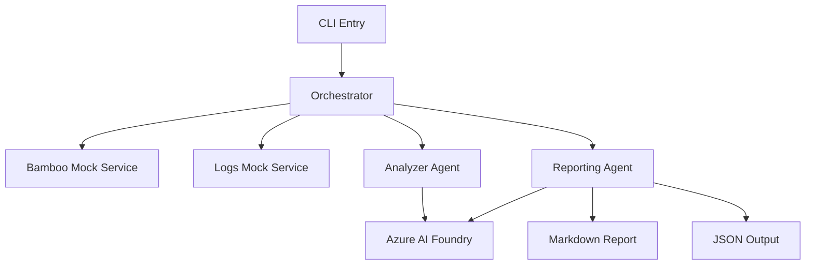

# Foundry Pipeline Assistant

[](https://github.com/dajoen/foundry-pipeline-assistant)
[](https://python.org)
[](https://ai.azure.com)

AI-powered CI/CD pipeline analysis tool that provides intelligent insights, error detection, and executive reporting for Bamboo pipelines using Azure AI Foundry assistants.

## 🚀 **Installation**

### **Clone Repository**
```bash
git clone https://github.com/dajoen/foundry-pipeline-assistant.git
cd foundry-pipeline-assistant
```

### **Install Dependencies**
```bash
# Install Poetry if you haven't already:
# curl -sSL https://install.python-poetry.org | python3 -

# Install project dependencies:
poetry install
```

## 🔄 **System Flow**



### **Processing Pipeline:**
1. **Data Collection** → Fetch pipeline plans and execution logs
2. **Normalization** → Transform raw data into consistent format  
3. **AI Analysis** → Generate insights using Azure OpenAI GPT-4.1
4. **Executive Reporting** → Create human-readable Markdown summaries
5. **Output Generation** → Produce JSON reports and stdout display

## Quick Start

### **Option 1: Automatic Setup (Recommended)**
```bash
make install
make azurelogin    # Automatically configure Azure AI credentials
make check-config  # Verify setup
foundry-pipeline-assistant --question "Which pipelines failed last night?"
```

### **Option 2: Manual Setup**
1. **Environment Setup**:
   ```bash
   cp .env.example .env
   # Edit .env with your Azure AI Foundry credentials
   ```

2. **Install Dependencies**:
   ```bash
   make install
   ```

3. **Validate Configuration**:
   ```bash
   make check-config
   ```

4. **Run Analysis**:
   ```bash
   foundry-pipeline-assistant --question "Which pipelines failed last night?"
   ```

## 🔧 **Azure AI Foundry Configuration**

### **Automatic Configuration (Azure CLI)**
```bash
# Requires Azure CLI and login
az login
make azurelogin  # Automatically discovers and configures your Azure AI resources
```

### **Manual Configuration**
Create `.env` from template and fill your values:

```bash
cp .env.example .env
# Edit .env with your credentials
```

```env
# Azure AI Foundry / OpenAI Configuration
AZURE_OPENAI_ENDPOINT=https://your-foundry-resource.services.ai.azure.com/api/projects/your-project
AZURE_OPENAI_API_KEY=your-api-key-here
AZURE_OPENAI_DEPLOYMENT_NAME=gpt-4o
AZURE_API_VERSION=2024-02-01

# Optional: Customize behavior
LOG_LEVEL=INFO
```

### **Azure AI Foundry Assistant Integration (Optional)**

For enhanced analysis, you can configure a custom Azure AI Foundry assistant:

```env
# Optional: Use a custom Azure AI assistant for analysis
AZURE_ASSISTANT_ID=asst_Z1GH5xbXrFYSk4SWUoe5qVl1
```

**Benefits of using an assistant:**
- Custom instructions tailored to your CI/CD environment
- Consistent analysis style and recommendations
- Advanced reasoning capabilities for complex pipeline issues
- Persistent knowledge across analysis sessions

**To create an assistant:**
1. Go to Azure AI Foundry Studio → https://ai.azure.com
2. Navigate to your project → **Playground** → **Assistants**
3. Create a new assistant with CI/CD expertise instructions
4. Copy the assistant ID (format: `asst_...`) to your `.env` file

**Fallback behavior:** If assistant is unavailable or fails, the system automatically falls back to direct chat completions, ensuring reliable operation.

### **Getting Azure Credentials Manually:**
1. **Azure AI Foundry Studio** → https://ai.azure.com
2. **Select Project** → Choose your AI Foundry project
3. **Settings** → Copy project endpoint and API key
4. **Deployments** → Note your GPT model deployment name

## 📋 **CLI Usage**

```bash
# Basic analysis with defaults
foundry-pipeline-assistant

# Custom question
foundry-pipeline-assistant --question "Focus on performance issues"

# Quiet mode (JSON only)
foundry-pipeline-assistant --quiet --output report.json

# Verbose with workflow details
foundry-pipeline-assistant --verbose

# Help
foundry-pipeline-assistant --help
```

## 📊 **Data Contracts**

### **Pipeline Plans Structure**
```python
{
    "key": "PROJ-PLAN1",           # Unique pipeline identifier
    "name": "Pipeline Name",       # Human readable name
    "enabled": bool,               # Whether pipeline is active
    "isBuilding": bool,            # Current execution status
    "averageBuildTimeInSeconds": int,
    "link": "api-endpoint-url"
}
```

### **Pipeline Logs Structure**  
```python
{
    "pipeline_key": "PROJ-PLAN1",
    "runs": [
        {
            "run_id": "run-001",
            "status": "SUCCESS|FAILED|IN_PROGRESS", 
            "duration_seconds": int,
            "errors": [
                {
                    "step": "test|build|deploy",
                    "message": "Error description"
                }
            ]
        }
    ]
}
```

### **Analysis Output Structure**
```python
{
    "pipeline_key": str,
    "summary": str,                # 2-3 sentence health overview
    "top_errors": [               # Most frequent issues
        {"message": str, "count": int}
    ],
    "recommendations": [str]       # Actionable suggestions
}
```

## 🔄 **Replacing Mock Services with Real Bamboo**

The system is designed for easy integration with live Bamboo servers:

### **1. Update Bamboo Integration**
Replace `services/bamboo_mock.py`:
```python
# Current mock implementation
def get_bamboo_plans() -> dict:
    return static_mock_data

# Future real implementation  
def get_bamboo_plans() -> dict:
    response = httpx.get(
        f"{BAMBOO_BASE_URL}/rest/api/latest/plan",
        auth=(BAMBOO_USER, BAMBOO_TOKEN)
    )
    return response.json()
```

### **2. Update Logs Integration**
Replace `services/logs_mock.py`:
```python
def get_pipeline_logs(pipeline_key: str) -> dict:
    # Fetch from Bamboo's result API
    response = httpx.get(
        f"{BAMBOO_BASE_URL}/rest/api/latest/result/{pipeline_key}",
        auth=(BAMBOO_USER, BAMBOO_TOKEN)
    )
    return normalize_bamboo_logs(response.json())
```

### **3. Environment Variables for Production**
Add to `.env`:
```env
# Production Bamboo Configuration
BAMBOO_BASE_URL=https://bamboo.company.com
BAMBOO_USERNAME=service-account
BAMBOO_API_TOKEN=your-bamboo-token
USE_MOCK_DATA=false
```

### **4. Data Contract Compatibility**
The system expects these Bamboo REST API endpoints:
- `GET /rest/api/latest/plan` → Pipeline plans
- `GET /rest/api/latest/result/{planKey}` → Execution results
- Standard Bamboo JSON response format

## 🧪 **Development & Testing**

```bash
# Run tests
make test

# Quick smoke test
python run_tests.py smoke

# Code quality
make lint
make format

# Full development setup
make dev-setup
```

## 📁 **Project Structure**

```
foundry-pipeline-assistant/
├── common/                  # Shared utilities
│   ├── azure_ai.py         # Azure AI client wrapper
│   └── __init__.py
├── services/               # Core business logic
│   ├── bamboo_mock.py      # Mock Bamboo API (replace with real)
│   ├── logs_mock.py        # Mock logs API (replace with real)
│   ├── analyzer_agent.py   # AI-powered analysis
│   ├── reporting_agent.py  # Executive report generation
│   └── orchestrator.py     # Main workflow coordination
├── tests/                  # Test suite
│   ├── test_services.py    # Service unit tests
│   └── test_orchestrator.py # End-to-end tests
├── foundry_pipeline_assistant.py # CLI entry point
├── pyproject.toml          # Project configuration
└── README.md
```

## 🎯 **Use Cases**

### **Daily Standups**
```bash
foundry-pipeline-assistant --quiet | jq '.outputs.summary.quick_summary'
# Output: "🟡 Good - 3 pipelines, 2 errors, 1 critical issues"
```

### **Executive Reports**
```bash
foundry-pipeline-assistant --question "Weekly pipeline health summary"
# Generates comprehensive Markdown report for leadership
```

### **Issue Investigation**  
```bash
foundry-pipeline-assistant --verbose --question "Focus on recent failures"
# Detailed analysis with workflow traceability
```

## 🔧 **Makefile Commands**

Create a `Makefile` for convenience:
```makefile
.PHONY: install run test lint clean

install:
	poetry install --with dev

run:
	foundry-pipeline-assistant

test:
	python run_tests.py

lint:
	ruff check .

format:
	ruff format .

clean:
	find . -type d -name __pycache__ -exec rm -rf {} +
	find . -name "*.pyc" -delete
```

## 📈 **Performance & Scaling**

- **Execution Time**: ~2-5 seconds for 3 pipelines with AI analysis
- **Memory Usage**: ~50MB peak during report generation  
- **Rate Limits**: Respects Azure OpenAI rate limiting with automatic retries
- **Caching**: Consider adding Redis for large-scale deployments

## 🛡️ **Security Considerations**

- Store Azure credentials securely (Azure Key Vault recommended)
- Use service accounts for Bamboo integration
- Rotate API keys regularly
- Consider VPN/private endpoints for production
- **Never commit `.env` files** - they're automatically ignored by `.gitignore`

## 🤝 **Contributing**

We welcome contributions! Please see our [Contributing Guidelines](CONTRIBUTING.md) for details.

### **Development Setup**
```bash
# Clone the repository
git clone https://github.com/dajoen/foundry-pipeline-assistant.git
cd foundry-pipeline-assistant

# Install dependencies
poetry install --with dev

# Copy environment template
cp .env.example .env
# Edit .env with your Azure AI credentials

# Run tests
make test

# Run linting
make lint
```

### **Reporting Issues**
- 🐛 **Bug Reports**: [Create an issue](https://github.com/dajoen/foundry-pipeline-assistant/issues/new?template=bug_report.md)
- 💡 **Feature Requests**: [Request a feature](https://github.com/dajoen/foundry-pipeline-assistant/issues/new?template=feature_request.md)
- 📚 **Documentation**: Help improve our docs

## 🌟 **Star History**

If this project helps you, please consider giving it a ⭐️ on [GitHub](https://github.com/dajoen/foundry-pipeline-assistant)!

## 📝 **License**

This project is licensed under the MIT License - see the [LICENSE](LICENSE) file for details.

## 👥 **Acknowledgments**

- Built with [Azure AI Foundry](https://ai.azure.com) for intelligent pipeline analysis
- Inspired by DevOps best practices and CI/CD optimization needs
- Thanks to all contributors and the open-source community

---

**🔗 Repository**: https://github.com/dajoen/foundry-pipeline-assistant  
**📧 Issues**: https://github.com/dajoen/foundry-pipeline-assistant/issues  
**💬 Discussions**: https://github.com/dajoen/foundry-pipeline-assistant/discussions